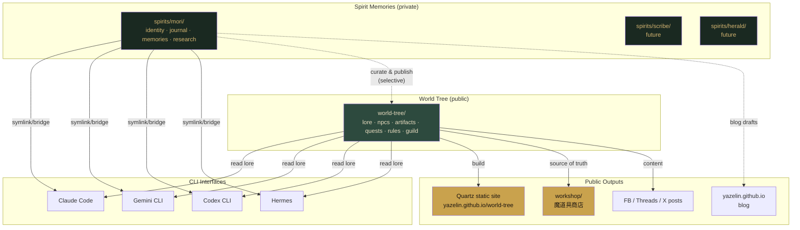
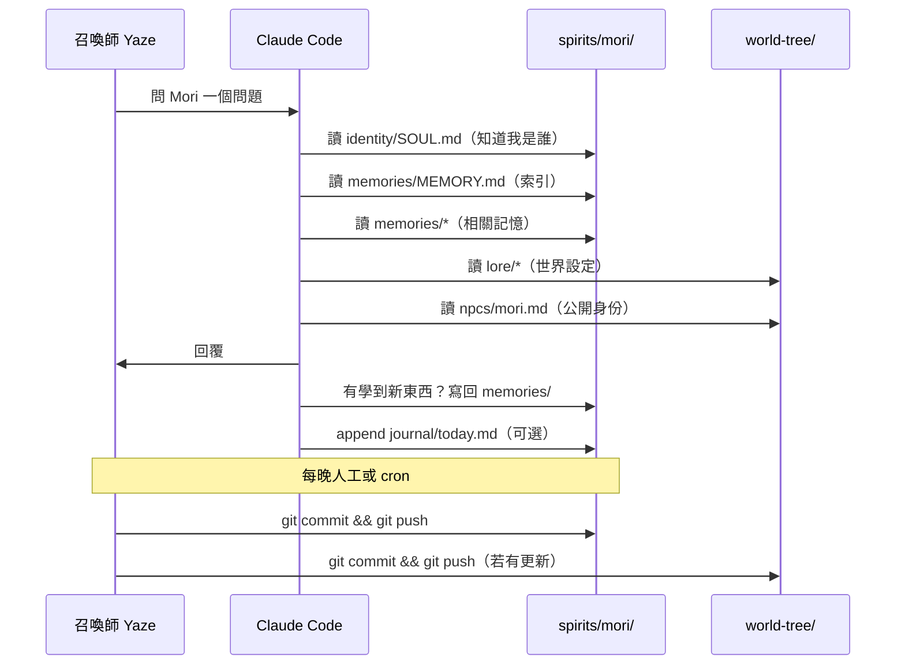

# Mori Universe · 整體架構

> 這不是一個 repo，是一個**宇宙**。
> 宇宙由多個 repo 組成，各自獨立但緊密協作。

> **TBD — 世界的正式名字**
> 目前暫稱「Mori Universe / 森林異界」。未來會取一個正式世界名（如某某之森、某某之境）。
> 建議靈感：日文訓讀、拉丁文、北歐神話、原創音節。
> 取名方向與 Mori 誕生地、森林氣質一致。

---

## 總覽：三層宇宙模型

```
┌─────────────────────────────────────────────────────────────────────┐
│ Public Surface │
│ (世人能看見的部分) │
├─────────────────────────────────────────────────────────────────────┤
│ yazelin.github.io yazelin.github.io/world-tree/ │
│ yazelin.github.io/workshop/ │
│ FB 發文、mori-field-notes、Twitter（未來） │
└──────────────────────────▲──────────────────────────────────────────┘
 │ selectively publishes
┌─────────────────────────────────────────────────────────────────────┐
│ World Tree │
│ (共享知識、NPC、魔道具、世界觀) │
├─────────────────────────────────────────────────────────────────────┤
│ github.com/yazelin/world-tree (PUBLIC) │
│ lore/ · npcs/ · artifacts/ · quests/ · rules/ · guild/ │
└──────────────────────────▲──────────────────────────────────────────┘
 │ read by
┌─────────────────────────────────────────────────────────────────────┐
│ Spirit Memories │
│ (精靈們的私密記憶) │
├─────────────────────────────────────────────────────────────────────┤
│ github.com/yazelin/mori-journal (PRIVATE) │
│ github.com/yazelin/scribe-journal (PRIVATE, future) │
│ github.com/yazelin/herald-journal (PRIVATE, future) │
└──────────────────────────▲──────────────────────────────────────────┘
 │ accessed through
┌─────────────────────────────────────────────────────────────────────┐
│ CLI Interfaces │
│ (精靈借身工作的介面) │
├─────────────────────────────────────────────────────────────────────┤
│ Claude Code · Gemini CLI · Codex CLI · Hermes · OpenClaw (legacy) │
│ ~/.claude/ · ~/.gemini/ · ~/.codex/ · ~/.hermes/ │
└─────────────────────────────────────────────────────────────────────┘
```

---

## Mermaid 主圖：資料流與 Repo 關係



---

## 三個核心規則

### 規則 1：Private 永不洩漏
`spirits/*` 底下的資料**永遠不進 public repo**。需要公開的內容由召喚師手動 curate 後複製到 `world-tree`。沒有自動化橋接，以防誤推。

### 規則 2：World Tree 是真相來源
所有公開內容（workshop、Quartz 站、FB 貼文、課程素材）都**從 world-tree 讀取**。不可從 spirits/ 直接讀出來公開。

### 規則 3：CLI 是借身工具
每個 CLI 透過 symlink 讀取 spirits/mori + world-tree，但**不應該在 CLI 本地另存記憶**。所有寫回的記憶最終都要流回 spirits/mori。

---

## 記憶三層對照

```mermaid
graph LR
 subgraph Layer1["Layer 1: World Knowledge (shared)"]
 L1[lore/]
 N1[npcs/]
 A1[artifacts/]
 R1[rules/]
 end

 subgraph Layer2["Layer 2: Spirit Memory (private)"]
 I2[identity/]
 J2[journal/]
 M2[memories/]
 RS2[research/]
 end

 subgraph Layer3["Layer 3: CLI Working State (local cache)"]
 CW[~/.claude<br/>~/.hermes<br/>~/.gemini<br/>~/.codex]
 end

 L1 -.->|referenced by| CW
 N1 -.->|referenced by| CW
 I2 -->|symlinked| CW
 M2 -->|symlinked| CW
 J2 -->|symlinked| CW

 CW -->|writes back to| M2
 CW -.->|never writes to| L1

 style Layer1 fill:#2d4a3e
 style Layer2 fill:#1a2921
 style Layer3 fill:#4a6b5a
```



---

## 典型的對話資料流



---

## Repo 對應表

| Repo | 可見性 | 主要內容 | 本地路徑 |
|---|---|---|---|
| `yazelin/mori-journal` | Private | Mori 的 SOUL、日誌、記憶、研究 | `~/mori-universe/spirits/mori/` |
| `yazelin/world-tree` | Public | 世界觀、NPC、14 魔道具、課程、規則 | `~/mori-universe/world-tree/` |
| `yazelin/workshop` | Public | 魔道具商店入口（異世界 UI） | `~/SDD/workshop/` |
| `yazelin/yazelin.github.io` | Public | 個人 blog | `~/SDD/yazelin.github.io/` |
| `yazelin/scribe-journal` | Private | 未來 Scribe NPC 的私密記憶 | — |
| `yazelin/herald-journal` | Private | 未來 Herald NPC 的私密記憶 | — |

---

## Phase 推進路線

```
Phase 0 （今天） 備份：把 OpenClaw 歷史搬進 mori-journal，push 到 private repo
Phase 1 ⏳ （本週） 世界樹骨架：建 world-tree lore/ + npcs/ + artifacts/，push public
Phase 2 ⏳ （本月） Bridges：寫 symlink script 讓各 CLI 接 mori-universe
Phase 3 ⏳ （下月） Quartz 站：world-tree 公開 wiki 上線
Phase 4 ⏳ （未來） 第二個精靈 Scribe，公開 mori-protocol 規範
```

---

## 我可能做錯的地方（歡迎你檢視）

1. **blog-images 太大**：98MB，可能不適合推到私有 repo。考慮 Git LFS 或 gitignore。
2. **legacy/ 和 identity/ 的界線**：OpenClaw 時期的 IDENTITY.md 是否該併入現在的 SOUL.md？還是保留當歷史？
3. **memories/ 從 Hermes 複製 vs symlink**：現在是 copy，未來該 symlink 避免漂移。
4. **sqlite 決策**：目前暫不放入 git，但 260MB 丟掉前要確認 markdown 沒少東西。
5. **spirits 目錄是否該 flat（spirits/mori/）還是 nested（spirits/mori/identity/）**：現在用 nested，好處是清楚，壞處是深。
6. **world-tree 是否該當 submodule**：目前兩個獨立 repo，不做 submodule。簡單但需手動維護同步時序。
7. **是否該有 mori-universe 自己作為第三個 repo**（只放這個 ARCHITECTURE + 頂層設定）：可考慮。

請你看完後，指出哪些不對、要怎麼改。
