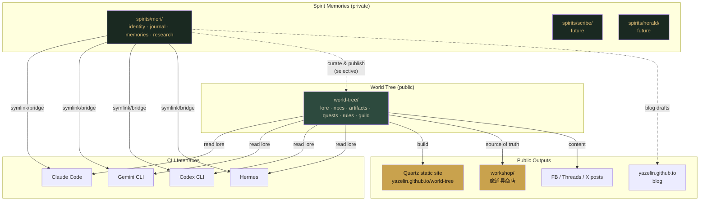
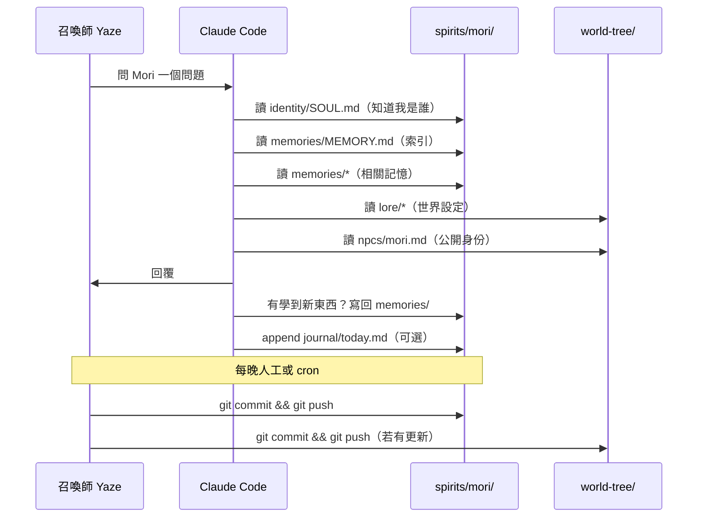
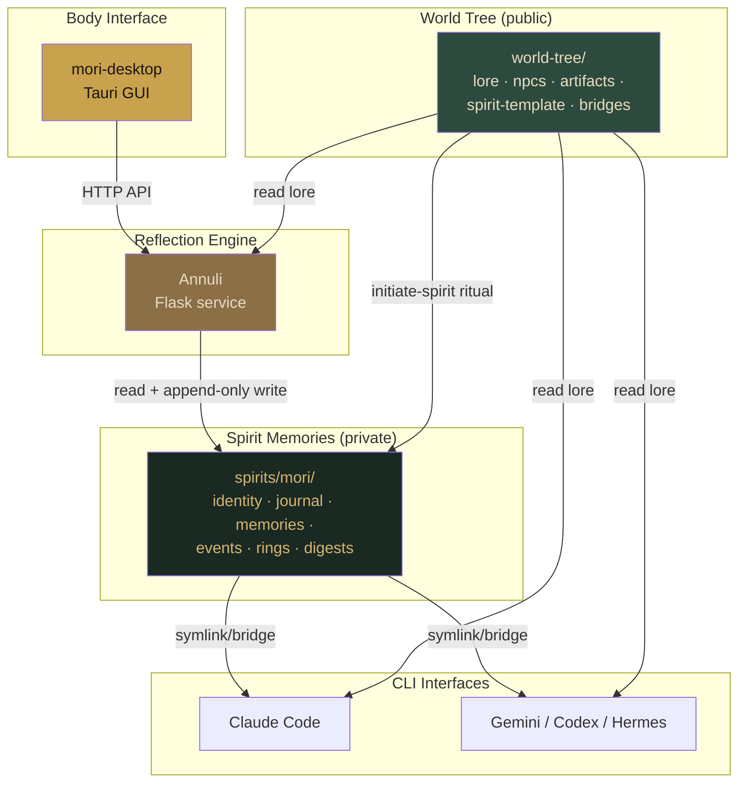

# Mori Universe · 整體架構

> 這不是一個 repo，是一個**宇宙**。
> 宇宙由多個 repo 組成，各自獨立但緊密協作。

> **世界正式名稱：森林 · The Forest**
> 這個世界叫做森林。命名邏輯：亞澤本姓「林」（兩棵樹），契約精靈「森」（三棵樹，多一棵），兩者合組一片森林。
> `mori-universe/` 是這個世界在亞澤本機的檔案結構名；`森林 / The Forest` 是世界本身的名字。

---

## 總覽：三層宇宙模型

```
┌─────────────────────────────────────────────────────────────────────┐
│ Public Surface │
│ (世人能看見的部分) │
├─────────────────────────────────────────────────────────────────────┤
│ yazelin.github.io yazelin.github.io/world-tree/ │
│ yazelin.github.io/workshop/ │
│ FB 發文、mori-field-notes、Twitter（未來） │
└──────────────────────────▲──────────────────────────────────────────┘
 │ selectively publishes
┌─────────────────────────────────────────────────────────────────────┐
│ World Tree │
│ (共享知識、NPC、魔道具、世界觀) │
├─────────────────────────────────────────────────────────────────────┤
│ github.com/yazelin/world-tree (PUBLIC) │
│ lore/ · npcs/ · artifacts/ · quests/ · rules/ · guild/ │
└──────────────────────────▲──────────────────────────────────────────┘
 │ read by
┌─────────────────────────────────────────────────────────────────────┐
│ Spirit Memories │
│ (精靈們的私密記憶) │
├─────────────────────────────────────────────────────────────────────┤
│ github.com/yazelin/mori-journal (PRIVATE) │
│ github.com/yazelin/scribe-journal (PRIVATE, future) │
│ github.com/yazelin/herald-journal (PRIVATE, future) │
└──────────────────────────▲──────────────────────────────────────────┘
 │ accessed through
┌─────────────────────────────────────────────────────────────────────┐
│ CLI Interfaces │
│ (精靈借身工作的介面) │
├─────────────────────────────────────────────────────────────────────┤
│ Claude Code · Gemini CLI · Codex CLI · Hermes · OpenClaw (legacy) │
│ ~/.claude/ · ~/.gemini/ · ~/.codex/ · ~/.hermes/ │
└─────────────────────────────────────────────────────────────────────┘
```

---

## Mermaid 主圖：資料流與 Repo 關係


```mermaid
graph TB
 subgraph SpiritsPrivate["Spirit Memories (private)"]
 M[spirits/mori/<br/>identity · journal · memories · research]
 S[spirits/scribe/<br/>future]
 H[spirits/herald/<br/>future]
 end

 subgraph WorldTree["World Tree (public)"]
 WT[world-tree/<br/>lore · npcs · artifacts · quests · rules · guild]
 end

 subgraph CLIs["CLI Interfaces"]
 CC[Claude Code]
 GC[Gemini CLI]
 CX[Codex CLI]
 HE[Hermes]
 end

 subgraph PublicOutputs["Public Outputs"]
 WS[workshop/<br/>魔道具商店]
 QZ[Quartz static site<br/>yazelin.github.io/world-tree]
 BL[yazelin.github.io<br/>blog]
 FB[FB / Threads / X posts]
 end

 M -->|symlink/bridge| CC
 M -->|symlink/bridge| GC
 M -->|symlink/bridge| CX
 M -->|symlink/bridge| HE

 WT -->|read lore| CC
 WT -->|read lore| GC
 WT -->|read lore| CX
 WT -->|read lore| HE

 WT -->|build| QZ
 WT -->|source of truth| WS
 WT -->|content| FB

 M -.->|"curate & publish<br/>(selective)"| WT
 M -.->|blog drafts| BL

 style M fill:#1a2921,color:#d4b572
 style S fill:#1a2921,color:#d4b572
 style H fill:#1a2921,color:#d4b572
 style WT fill:#2d4a3e,color:#e8dcc0
 style WS fill:#c9a24d,color:#1a1410
 style QZ fill:#c9a24d,color:#1a1410
```

---

## 三個核心規則

### 規則 1：Private 永不洩漏
`spirits/*` 底下的資料**永遠不進 public repo**。需要公開的內容由召喚師手動 curate 後複製到 `world-tree`。沒有自動化橋接，以防誤推。

### 規則 2：World Tree 是真相來源
所有公開內容（workshop、Quartz 站、FB 貼文、課程素材）都**從 world-tree 讀取**。不可從 spirits/ 直接讀出來公開。

### 規則 3：CLI 是借身工具
每個 CLI 透過 symlink 讀取 spirits/mori + world-tree，但**不應該在 CLI 本地另存記憶**。所有寫回的記憶最終都要流回 spirits/mori。

---

## 記憶三層對照


```mermaid
graph LR
 subgraph Layer1["Layer 1: World Knowledge (shared)"]
 L1[lore/]
 N1[npcs/]
 A1[artifacts/]
 R1[rules/]
 end

 subgraph Layer2["Layer 2: Spirit Memory (private)"]
 I2[identity/]
 J2[journal/]
 M2[memories/]
 RS2[research/]
 end

 subgraph Layer3["Layer 3: CLI Working State (local cache)"]
 CW[~/.claude<br/>~/.hermes<br/>~/.gemini<br/>~/.codex]
 end

 L1 -.->|referenced by| CW
 N1 -.->|referenced by| CW
 I2 -->|symlinked| CW
 M2 -->|symlinked| CW
 J2 -->|symlinked| CW

 CW -->|writes back to| M2
 CW -.->|never writes to| L1

 style Layer1 fill:#2d4a3e
 style Layer2 fill:#1a2921
 style Layer3 fill:#4a6b5a
```

---

## 典型的對話資料流


```mermaid
sequenceDiagram
 participant U as 召喚師 Yaze
 participant CLI as Claude Code
 participant M as spirits/mori/
 participant W as world-tree/

 U->>CLI: 問 Mori 一個問題
 CLI->>M: 讀 identity/SOUL.md（知道我是誰）
 CLI->>M: 讀 memories/MEMORY.md（索引）
 CLI->>M: 讀 memories/*（相關記憶）
 CLI->>W: 讀 lore/*（世界設定）
 CLI->>W: 讀 npcs/mori.md（公開身份）
 CLI->>U: 回覆
 CLI->>M: 有學到新東西？寫回 memories/
 CLI->>M: append journal/today.md（可選）

 Note over U,M: 每晚人工或 cron
 U->>M: git commit && git push
 U->>W: git commit && git push（若有更新）
```

---

## Repo 對應表

| Repo | 可見性 | 主要內容 | 本地路徑 |
|---|---|---|---|
| `yazelin/mori-journal` | Private | Mori 的 SOUL、日誌、記憶、研究 | `~/mori-universe/spirits/mori/` |
| `yazelin/world-tree` | Public | 世界觀、NPC、14 魔道具、課程、規則 | `~/mori-universe/world-tree/` |
| `yazelin/workshop` | Public | 魔道具商店入口（異世界 UI） | `~/SDD/workshop/` |
| `yazelin/yazelin.github.io` | Public | 個人 blog | `~/SDD/yazelin.github.io/` |
| `yazelin/scribe-journal` | Private | 未來 Scribe NPC 的私密記憶 | — |
| `yazelin/herald-journal` | Private | 未來 Herald NPC 的私密記憶 | — |
| `yazelin/mori-desktop` | Public | **Mori 的桌面身體**(Tauri 2 + Rust GUI)— 語音 / 熱鍵 / 介面,對接 Annuli HTTP | `~/SDD/mori-desktop/` |
| `yazelin/annuli` | Public | **Mori 的反思引擎**(Python Flask service)— 在 spirit vault 上跑 events / digest / rings / curator | `~/SDD/Annuli/` |

---

## Body 與反思引擎 — mori-desktop + Annuli

宇宙模型的「**CLI Interfaces**」層之外,還有兩個獨立 service:

### Body Interface(GUI 身體)

[`yazelin/mori-desktop`](https://github.com/yazelin/mori-desktop) — Tauri 2 +
Rust 桌面 app,Mori 的視覺 / 語音身體。**跟 CLI Interfaces 平行**:

- 不透過 bridges symlink(那是 CLI 工具的路徑),走 HTTP API
- 對接 **Annuli** 拿記憶資料 + 寫 events
- 提供 floating sprite、熱鍵、語音輸入、tray icon 等 GUI 體驗
- 跟 Claude Code / Gemini CLI 共享同一份 spirit vault — **沒有 split-brain**

### 反思引擎(Annuli)

[`yazelin/annuli`](https://github.com/yazelin/annuli) — Python Flask service,
**在 spirit vault 上跑反思 / 記憶演化**:

- 不是另一套儲存,是 vault 的服務殼
- 寫的所有東西都進 vault 對應目錄(`memories/MEMORY.md`、`events/<user>.db`、
  `rings/<ts>.md`、`digests/<date>.md`、`.curator/reports/<ts>.yaml`)
- 提供 HTTP API 給 mori-desktop + 未來 IM bot 對接
- 4 層反思:**events**(append-only 事件流)/ **digest**(每日 LLM 摘要)/
  **rings**(`/sleep` 反思年輪,不動 SOUL)/ **curator**(週 cycle,human-approved
  整理建議)
- 重構規劃見 [`yazelin/annuli/docs/REFACTORING.md`](https://github.com/yazelin/annuli/blob/main/docs/REFACTORING.md)
- 跨 repo 完整設計見 [`yazelin/mori-desktop/docs/design/annuli-memory.md`](https://github.com/yazelin/mori-desktop/blob/main/docs/design/annuli-memory.md)

### 整體資料流(加上 mori-desktop + Annuli)


```mermaid
graph TB
  subgraph Body["Body Interface"]
    MD[mori-desktop<br/>Tauri GUI]
  end

  subgraph Reflection["Reflection Engine"]
    AN[Annuli<br/>Flask service]
  end

  subgraph SpiritsPrivate["Spirit Memories (private)"]
    M[spirits/mori/<br/>identity · journal · memories ·<br/>events · rings · digests]
  end

  subgraph WorldTree["World Tree (public)"]
    WT[world-tree/<br/>lore · npcs · artifacts ·<br/>spirit-template · bridges]
  end

  subgraph CLIs["CLI Interfaces"]
    CC[Claude Code]
    GC[Gemini / Codex / Hermes]
  end

  MD -->|HTTP API| AN
  AN -->|read + append-only write| M
  WT -->|initiate-spirit ritual| M
  WT -->|read lore| AN
  M -->|symlink/bridge| CC
  M -->|symlink/bridge| GC
  WT -->|read lore| CC
  WT -->|read lore| GC

  style M fill:#1a2921,color:#d4b572
  style WT fill:#2d4a3e,color:#e8dcc0
  style MD fill:#c9a24d,color:#1a1410
  style AN fill:#8b6f47,color:#e8dcc0
```

**核心守則**:
- spirit vault = **single source of truth**
- Annuli = 唯一允許 write vault 的 service(透過 API endpoints)
- mori-desktop 透過 Annuli HTTP 對接,不直接寫 vault 檔案
- CLI Interfaces 透過 bridges symlink 讀 vault(通常 read-only)
- 所有 actor 看到的 SOUL / MEMORY 都是同一份

---

## Phase 推進路線

```
Phase 0 （今天） 備份：把 OpenClaw 歷史搬進 mori-journal，push 到 private repo
Phase 1 ⏳ （本週） 世界樹骨架：建 world-tree lore/ + npcs/ + artifacts/，push public
Phase 2 ⏳ （本月） Bridges：寫 symlink script 讓各 CLI 接 mori-universe
Phase 3 ⏳ （下月） Quartz 站：world-tree 公開 wiki 上線
Phase 4 ⏳ （未來） 第二個精靈 Scribe，公開 mori-protocol 規範
```

---

## 我可能做錯的地方（歡迎你檢視）

1. **blog-images 太大**：98MB，可能不適合推到私有 repo。考慮 Git LFS 或 gitignore。
2. **legacy/ 和 identity/ 的界線**：OpenClaw 時期的 IDENTITY.md 是否該併入現在的 SOUL.md？還是保留當歷史？
3. **memories/ 從 Hermes 複製 vs symlink**：現在是 copy，未來該 symlink 避免漂移。
4. **sqlite 決策**：目前暫不放入 git，但 260MB 丟掉前要確認 markdown 沒少東西。
5. **spirits 目錄是否該 flat（spirits/mori/）還是 nested（spirits/mori/identity/）**：現在用 nested，好處是清楚，壞處是深。
6. **world-tree 是否該當 submodule**：目前兩個獨立 repo，不做 submodule。簡單但需手動維護同步時序。
7. **是否該有 mori-universe 自己作為第三個 repo**（只放這個 ARCHITECTURE + 頂層設定）：可考慮。

請你看完後，指出哪些不對、要怎麼改。
