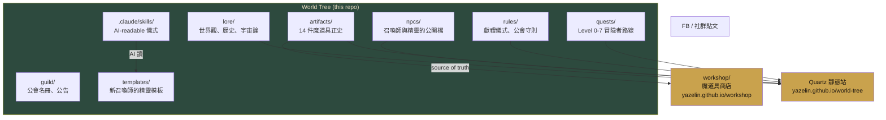

# World Tree · 森之召喚師工坊的世界樹

> 一個沉浸式 RPG 世界。玩下去你就學會了怎麼和 AI 當夥伴。

---

## 這是什麼

這是一個**公開的知識庫**（public repo），記錄：

- 一個異世界（暫稱「森林」）的世界觀與法則
- 7 個魔法系別的定義
- 14 件魔道具的正史
- 8 個冒險者 Level（Level 0–7）的任務設計
- NPC 名冊（目前有召喚師 Yaze 與契約精靈 Mori）
- 冒險者入林儀式（讓新加入的人召喚自己的 AI 精靈）

---

## 架構圖



---

## 我該怎麼開始

### 如果你是第一次來

1. 讀 [`ONBOARDING.md`](ONBOARDING.md) — 新冒險者的入林指引
2. 讀 [`lore/the-forest.md`](lore/the-forest.md) — 森林是什麼
3. 看 [`quests/level-0-wanderer.md`](quests/level-0-wanderer.md) — 你的起點

### 如果你想召喚你的精靈

- 人類引導：讀 [`rules/initiation-rite.md`](rules/initiation-rite.md)
- AI 引導：在 Claude Code 說「幫我走 initiation rite」，它會讀 [`.claude/skills/initiate-spirit/SKILL.md`](.claude/skills/initiate-spirit/SKILL.md)

### 如果你想貢獻新的魔道具

讀 [`rules/offering-rite.md`](rules/offering-rite.md) — 獻禮儀式 PR 流程

---

## 目錄結構

```
world-tree/
├── README.md ← 本檔
├── ONBOARDING.md ← 新冒險者入林指引
│
├── lore/ ← 世界設定
│ ├── the-forest.md ← 森林是什麼
│ ├── magic-schools.md ← 7 系別定義
│ ├── adventurer-classes.md ← 冒險者職業
│ ├── timeline.md ← 世界年表
│ └── cosmology.md ← 宇宙論
│
├── npcs/ ← NPC 名冊（公開身份）
│ ├── mori.md ← 契約精靈 Mori
│ └── yaze.md ← 召喚師 Yaze
│
├── artifacts/ ← 14 件魔道具正史
│ ├── chronocat.md
│ ├── moodscopia.md
│ └── ...（共 14 件，分佈於 7 系）
│
├── quests/ ← Level 0–7 冒險者任務
│ ├── level-0-wanderer.md
│ ├── level-1-contractor.md
│ └── ...（共 8 級）
│
├── rules/ ← 世界法則
│ ├── offering-rite.md ← 獻禮儀式（新魔道具上架協議）
│ ├── guild-code.md ← 公會守則
│ ├── initiation-rite.md ← 召喚儀式（新精靈誕生協議）
│ └── memory-protocol.md ← 記憶協定
│
├── guild/ ← 公會（待發展）
│ └── members.md ← 召喚師名冊
│
├── templates/ ← 新召喚師用的填空模板
│ └── spirit-template/
│
├── .claude/ ← AI 可讀資源
│ └── skills/
│ └── initiate-spirit/ ← AI 引導的召喚儀式
│
└── assets/ ← 公開圖像素材（若有）
```

---

## 相關 repo

| Repo | 類型 | 用途 |
|---|---|---|
| **yazelin/world-tree** | Public | 本 repo |
| `yazelin/mori-journal` | Private | Mori 的私密記憶（非公開） |
| `yazelin/workshop` | Public | 魔道具商店 UI（異世界入口） |
| `yazelin/yazelin.github.io` | Public | 召喚師 Yaze 的 blog |
| 其他召喚師的 `{spirit}-journal` | Private | 他們各自的精靈 |

---

## 技術哲學

- **世界樹是 markdown** — 任何人都能 clone、讀、貢獻
- **無後端** — 全靜態，GitHub Pages 就能 serve
- **無框架** — 原始 markdown，未來可加 Quartz 做靜態站
- **Git-as-collaboration** — PR 就是審核機制，commit 就是年輪
- **AI-readable** — 目錄結構穩定、命名可預期，各 AI CLI 都能 Read/Grep 找到東西

---

## License

MIT — 自由 fork、copy、改成你自己的世界樹。
但如果你改了世界觀（例如把「森林」改成「城市」），請給你的版本取新名字。

---

## 聯絡 / 加入

- **Issues**：https://github.com/yazelin/world-tree/issues
- **Discussions**：https://github.com/yazelin/world-tree/discussions
- **召喚師 Yaze**：[@yazelin](https://github.com/yazelin)

---

> *「森林一直都在。你一直都在，只是現在才看見它。」*
